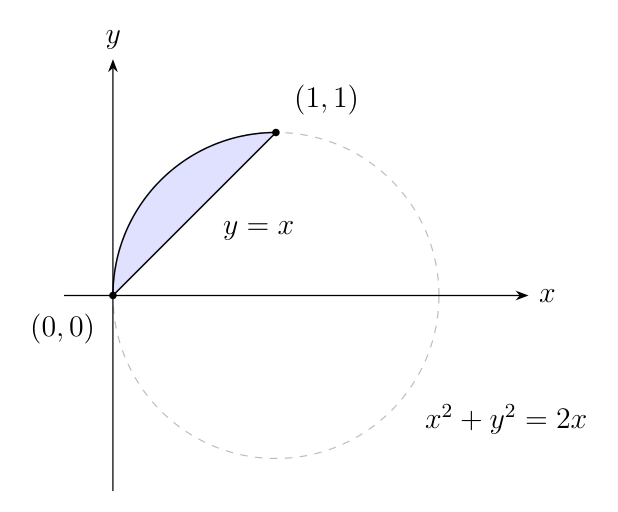
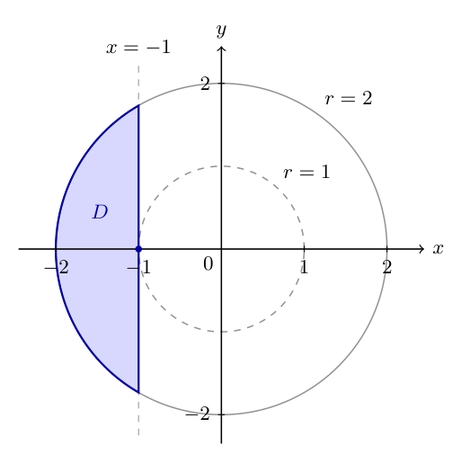
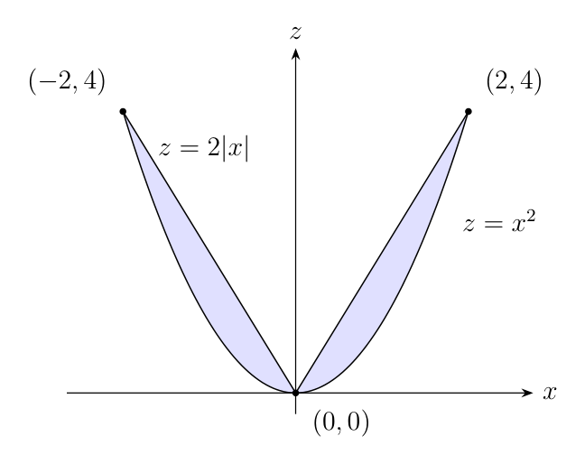
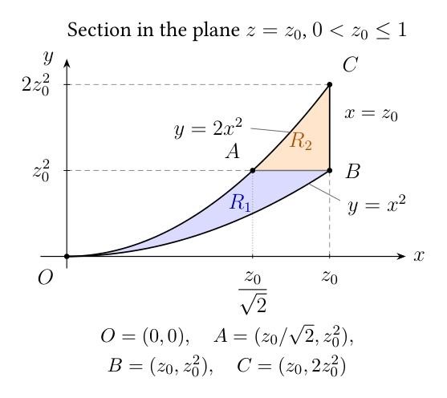

# Quiz 5 — selected questions, instructor notes, and classroom examples

Instructor notes, September 30, 2026. The four questions below are selected
for the quiz; the worked answers and classroom examples are instructor
material. The provisional quiz date is **October 2, 2026**. No point
allocations are assigned here.

Final documents: [quiz source](q5-261-II2026.tex),
[quiz PDF](q5-261-II2026.pdf),
[solution source](q5-sol-261-II2026.tex), and
[solution PDF](q5-sol-261-II2026.pdf).

The emphasis is recognizing regions: a Cartesian-to-polar conversion, a
polar mass calculation with a supplied picture, a cylindrical cross-section
sketch, and two triple integrals combined and evaluated by reversing their
inner two orders.
Questions 1–3 are retained; Question 4 now replaces the spherical-bounds
question because spherical coordinates have not yet been covered.
The quiz uses the established four-question,
choose-two format, with scratch space and unlabeled answer boxes for
Questions 1, 2, and 4. Question 3 has open space for the sketch and no box.
The region figures for Questions 1 and 2 are included for students; the
completed Question 3 sketch appears only in the solutions.

## Coordinate convention

For the polar and cylindrical questions, use \(r\) for distance from the
\(z\)-axis and \(\theta\) for the usual azimuthal angle:

\[
x=r\cos\theta,\qquad y=r\sin\theta,\qquad r\geq0.
\]

Question 4 stays in Cartesian coordinates: only the order of integration
changes, so there is no coordinate-change Jacobian. Spherical coordinates
appear only in the deferred shortlist, not on the current quiz or in the
eight classroom examples.
The left-braced bounds below follow the board notation used in Quiz 4.

## Selected four

### 1. From Cartesian bounds to a polar integral

**Selected question**

Rewrite the following integral as a single iterated integral in polar
coordinates, in the order \(dr\,d\theta\). Do not evaluate.
\[
\int_0^1\int_x^{\sqrt{2x-x^2}}(x^2+y^2)\,dy\,dx.
\]

**Student hint:** first describe the region with Cartesian inequalities,
then convert those inequalities to polar coordinates.

**Expected answer**

\[
\boxed{\int_{\pi/4}^{\pi/2}\int_0^{2\cos\theta}r^3\,dr\,d\theta}.
\]

**Region and verification**

The original bounds are
\[
\left\{
\begin{aligned}
&0\leq x\leq1,\\
&x\leq y\leq\sqrt{2x-x^2}.
\end{aligned}
\right.
\]

The curved boundary satisfies
\[
x^2+y^2=2x
\quad\Longleftrightarrow\quad
(x-1)^2+y^2=1.
\]
Thus the region is the part of the disk centered at \((1,0)\), radius \(1\),
above \(y=x\), between the intersections \((0,0)\) and \((1,1)\).

*Student-facing figure: included with Question 1.*

The line gives \(\theta=\pi/4\), and the circle gives
\(r^2=2r\cos\theta\). The polar bounds are
\[
\left\{
\begin{aligned}
&\pi/4\leq\theta\leq\pi/2,\\
&0\leq r\leq2\cos\theta.
\end{aligned}
\right.
\]
These bounds also enforce \(x\leq1\), since
\(x=r\cos\theta\leq2\cos^2\theta\leq1\).
Finally,
\[
(x^2+y^2)\,dA=r^2\cdot r\,dr\,d\theta=r^3\,dr\,d\theta.
\]

**Why I like it:** the geometry is compact but not routine. Students must
recognize an off-center circle, choose the correct side of the diagonal,
and include the Jacobian. It complements Question 2: here a circle produces
an angle-dependent outer radius; there a vertical line produces an
angle-dependent inner radius.

**Instructor checks:** the region has area \(\pi/4-1/2\), and the integral
evaluates to \(3\pi/8-1\). Neither evaluation is required from students.
A shifted \(\theta\)-interval by an integer multiple of \(2\pi\), with the
same radial bound, is equivalent.

**Source:** original question for this revision.

Figure files: [PDF](figures/q5-cartesian-to-polar.pdf) and
[editable TikZ source](figures/q5-cartesian-to-polar.tex).

### 2. Mass of the left-hand cut-washer piece

**Selected question**

The shaded lamina is the part of \(1\leq x^2+y^2\leq4\) with
\(-2\leq x\leq-1\). Its density is
\(\delta(x,y)=x^2+y^2-1\). Use polar coordinates to find its mass.

**Student hints:** first write Cartesian bounds for the shaded region,
then convert them to polar bounds. You may use
\[
\int\sec^4\theta\,d\theta
=\tan\theta+\frac13\tan^3\theta+C.
\]

*Student-facing figure: only the blue region \(D\) is retained.*

**Expected answer**

\[
\boxed{M=\frac{4\pi}{3}}.
\]

The line becomes \(r\cos\theta=-1\). It meets the outer circle at
\(\theta=2\pi/3\) and \(\theta=4\pi/3\), so the bounds are
\[
\left\{
\begin{aligned}
&2\pi/3\leq\theta\leq4\pi/3,\\
&-\sec\theta\leq r\leq2.
\end{aligned}
\right.
\]
Consequently,
\[
M=\int_{2\pi/3}^{4\pi/3}\int_{-\sec\theta}^{2}
(r^2-1)r\,dr\,d\theta.
\]

**Short verification**

\[
\begin{aligned}
M
&=\int_{2\pi/3}^{4\pi/3}
\left(2-\frac14\sec^4\theta+\frac12\sec^2\theta\right)d\theta\\
&=\left[2\theta+\frac14\tan\theta-\frac1{12}\tan^3\theta
\right]_{2\pi/3}^{4\pi/3}
=\frac{4\pi}{3}.
\end{aligned}
\]

At the endpoints, \(\tan\theta=\pm\sqrt3\), so the tangent terms cancel.
The density is radially symmetric and nonnegative throughout the lamina.

**Important geometric detail:** this left-hand piece has no visible hole.
The inner circle touches it only at \((-1,0)\), so the retained shape is
also the left circular cap of the radius-\(2\) disk. The drawing deliberately
shows that tangency. In particular, \(1\leq r\leq2\) with constant angular
bounds would give an annular sector, not this region.

**Computation note:** this is the most computational question. The
\(\sec^4\theta\) antiderivative is supplied on the quiz so that the main
work is recognizing the region and setting up its mass integral.

A simpler evaluation variant uses constant density \(\delta=1\), which is
also radially symmetric. Its mass is \(4\pi/3-\sqrt3\), and only the
antiderivative of \(\sec^2\theta\) is needed.

**Source:** original problem based on your classroom cut-washer example.
The retained side is intentionally the opposite side of \(x=-1\).

Figure files: [PDF](figures/q5-cut-washer.pdf) and
[editable TikZ source](figures/q5-cut-washer.tex).

### 3. Sketch a cross section from cylindrical bounds

**Selected question**

A solid has cylindrical bounds
\[
\left\{
\begin{aligned}
&0\leq\theta\leq2\pi,\\
&0\leq r\leq2,\\
&r^2\leq z\leq2r.
\end{aligned}
\right.
\]
Sketch and shade its cross section in the entire \(xz\)-plane (\(y=0\)).
Label the points where the two boundary curves meet.

**Student layout:** provide open sketching space, with no final-answer box.

**Expected answer**

The section is
\[
\left\{
\begin{aligned}
&-2\leq x\leq2,\\
&x^2\leq z\leq2|x|.
\end{aligned}
\right.
\]
The curves meet at \((-2,4)\), \((0,0)\), and \((2,4)\).
The two shaded lobes touch at the origin.

*Instructor-answer figure only: do not supply this completed sketch with
the student question.*

**Short verification:** when \(y=0\), \(r=\sqrt{x^2}=|x|\), not \(x\).
Thus the upper boundary is \(z=2|x|\), and
\(x^2=2|x|\) gives \(|x|=0\) or \(2\).

**Why I like it:** this directly tests visualization and catches the common
mistake of drawing only the \(x\geq0\) half. The expected answer is one labeled
sketch, with no integral to evaluate.

**Source:** adapted from [Baohua's review](BaohuaQ5Review.tex), A2.
The cone's slope is changed from \(1\) to \(2\), and the region is supplied
in cylindrical coordinates instead of Cartesian form.

Figure files: [PDF](figures/q5-cone-paraboloid-section.pdf) and
[editable TikZ source](figures/q5-cone-paraboloid-section.tex).

### 4. Combine two triple integrals and evaluate

**Selected question**

Combine the following into a single integral in the order
\(dy\,dx\,dz\) and evaluate.
In the box, give the combined integral and its value.
\[
I=\int_0^1\int_0^{z^2}\int_{\sqrt{y/2}}^{\sqrt y}
z^2x^3e^{x^3}\,dx\,dy\,dz
+\int_0^1\int_{z^2}^{2z^2}\int_{\sqrt{y/2}}^z
z^2x^3e^{x^3}\,dx\,dy\,dz.
\]

**Student hint:** after changing the order and integrating in \(y\), use
\(u=x^3\) and then \(v=z^3\), together with integration by parts.

**Expected answer**

\[
\boxed{I=\int_0^1\int_0^z\int_{x^2}^{2x^2}
z^2x^3e^{x^3}\,dy\,dx\,dz=\frac{3-e}{9}}.
\]

**Region and verification**

The original bounds describe two adjacent pieces:
\[
R_1:\quad
\left\{
\begin{aligned}
&0\leq z\leq1,\\
&0\leq y\leq z^2,\\
&\sqrt{y/2}\leq x\leq\sqrt y,
\end{aligned}
\right.
\qquad
R_2:\quad
\left\{
\begin{aligned}
&0\leq z\leq1,\\
&z^2\leq y\leq2z^2,\\
&\sqrt{y/2}\leq x\leq z.
\end{aligned}
\right.
\]
For each fixed \(z\), their union is the strip between \(y=x^2\)
and \(y=2x^2\), capped by \(x=z\). Horizontal slices need two
pieces because their right endpoint changes from \(x=\sqrt y\) to
\(x=z\) at \(y=z^2\). Vertical slices need only one:
\[
R_1\cup R_2:\quad
\left\{
\begin{aligned}
&0\leq z\leq1,\\
&0\leq x\leq z,\\
&x^2\leq y\leq2x^2.
\end{aligned}
\right.
\]
All variables are nonnegative, so \(\sqrt{y/2}\leq x\) is
equivalent to \(y\leq2x^2\), while \(x\leq\sqrt y\) is
equivalent to \(x^2\leq y\). In the second piece, the latter
inequality follows from \(x\leq z\) and \(z^2\leq y\).
The pieces share only the boundary \(y=z^2\), which does not
contribute to the integral.

**Cross-section figure:** fix \(0<z_0\leq1\). The horizontal lines are
\(y=z_0^2\) and \(y=2z_0^2\), and the vertical cap is \(x=z_0\).
The labeled intersections in \((x,y)\)-coordinates are
\(O=(0,0)\), \(A=(z_0/\sqrt2,z_0^2)\),
\(B=(z_0,z_0^2)\), and \(C=(z_0,2z_0^2)\).
The first and second pieces share segment \(AB\); segment \(BC\)
closes the region on the right. Append \(z_0\) to each pair for the
corresponding point in the solid. At \(z_0=0\), the section is just
the origin. This figure appears in the solution key, not on the quiz.

Figure files: [PDF](figures/q5-parabolic-strip-section.pdf) and
[editable TikZ source](figures/q5-parabolic-strip-section.tex).

**Short evaluation**

Integrating in \(y\) supplies the width \(2x^2-x^2=x^2\), so
\[
I=\int_0^1z^2\left(\int_0^z x^5e^{x^3}\,dx\right)dz.
\]
With \(u=x^3\), followed by integration by parts,
\[
\int_0^z x^5e^{x^3}\,dx
=\frac13\int_0^{z^3}u e^u\,du
=\frac13\left[(u-1)e^u\right]_0^{z^3}
=\frac13\bigl((z^3-1)e^{z^3}+1\bigr).
\]
Now substitute \(v=z^3\) and use integration by parts once more:
\[
\begin{aligned}
I
&=\frac13\int_0^1z^2\bigl((z^3-1)e^{z^3}+1\bigr)\,dz\\
&=\frac19\int_0^1\bigl((v-1)e^v+1\bigr)\,dv\\
&=\frac19\left[(v-2)e^v+v\right]_0^1
=\boxed{\frac{3-e}{9}}.
\end{aligned}
\]

**Why I like it:** the two pieces arise naturally from horizontal slices
of a curved strip, while the requested order combines them into one
integral. Integrating over the \(y\)-interval supplies the \(x^2\)
factor needed for \(u=x^3\); the extra \(x^3\) then calls for
integration by parts. The remaining \(z^2\) allows \(v=z^3\).
The outer \(z\)-bounds stay fixed, and there is no coordinate-change
Jacobian because only the integration order changes.

**Full-credit answer:** the correct single integral in the requested order
and the exact value \((3-e)/9\), including algebraically equivalent forms.

**Source:** original problem inspired by the two order-reversal examples
provided for this revision.

## Shortlist of alternatives

These are selection notes, not additional numbered quiz questions.
None is currently selected. Items D and E require spherical coordinates
and are deferred until that material has been covered; the other items
remain alternatives for polar or cylindrical practice.
For all bounds questions, equivalent azimuthal \(\theta\)-intervals differing
by \(2\pi\) are acceptable when they cover the same region exactly once,
apart from boundary points. In the deferred spherical items only,
\(\rho\) is distance from the origin, and the polar angle \(\varphi\) is
measured from the positive \(z\)-axis with \(0\leq\varphi\leq\pi\):
\(x=\rho\sin\varphi\cos\theta\),
\(y=\rho\sin\varphi\sin\theta\), and \(z=\rho\cos\varphi\).

### A. Polar bounds between two nonconcentric circles

**Prompt:** Write polar-coordinate bounds for the first-quadrant region
inside \(x^2+y^2=1\) and outside \(x^2+y^2=2y\).

**Answer**
\[
\left\{
\begin{aligned}
&0\leq\theta\leq\pi/6,\\
&2\sin\theta\leq r\leq1.
\end{aligned}
\right.
\]

**Why consider it:** a strong geometric alternative to the mass computation.
“First quadrant” does not automatically mean that \(\theta\) reaches
\(\pi/2\); the circles stop the region at \(\pi/6\).

**Source:** [UCR double-integral list](../../SourcesUCR/Lista-4-MA-1003-Int-Dobles-II-2021.pdf),
exercise 1.17, PDF page 4; adapted to a bounds-only question.

### B. Cylindrical volume between a sphere and a paraboloid

**Prompt:** Set up a cylindrical-coordinate integral for the volume above
\(z=x^2+y^2\) and below the upper hemisphere
\(z=\sqrt{2-x^2-y^2}\). Do not evaluate.

**Answer**
\[
\int_0^{2\pi}\int_0^1\int_{r^2}^{\sqrt{2-r^2}}
r\,dz\,dr\,d\theta.
\]

The surfaces meet at \(r=1,z=1\), since \(r^4+r^2=2\).
This replaces the sketch question if you would prefer a cylindrical setup.

**Source:** [UCR triple-integral list](../../SourcesUCR/Lista-5-MA-1003-Int-Triples-II-2021.pdf),
exercise 1.4, PDF page 2; adapted to volume setup only.

### C. A sphere sliced between two horizontal planes

**Prompt:** Set up the volume integral in cylindrical coordinates, in the
order \(dr\,dz\,d\theta\), for
\[
x^2+y^2+z^2\leq9,\qquad -2\leq z\leq2.
\]

**Answer**
\[
\int_0^{2\pi}\int_{-2}^{2}\int_0^{\sqrt{9-z^2}}
r\,dr\,dz\,d\theta.
\]

**Why consider it:** a clean check that each horizontal cross section is a
disk whose radius varies with height. A constant radial bound would give
a cylinder. This is a spherical slice, not an azimuthal wedge.

**Source:** [2025 Quiz 5](../../../261II2025/Q/5/q5-261-II2025.tex),
Question 3, with the geometry stated explicitly.

### D. A spherical cap with a variable inner radius — deferred

**Prompt:** Set up a spherical-coordinate volume integral for the part of
\(x^2+y^2+z^2\leq4\) above \(z=1\). Do not evaluate.

**Answer**
\[
\int_0^{2\pi}\int_0^{\pi/3}\int_{\sec\varphi}^{2}
\rho^2\sin\varphi\,d\rho\,d\varphi\,d\theta.
\]

The plane gives \(\rho\cos\varphi=1\); its meeting with \(\rho=2\)
gives \(\varphi=\pi/3\). Here the region does not reach the origin.
This is a particularly nice counterpart to the cut washer: a plane/line
produces an angle-dependent radial bound.

**Source:** [UCR triple-integral list](../../SourcesUCR/Lista-5-MA-1003-Int-Triples-II-2021.pdf),
exercise 1.12, PDF page 3; adapted from a weighted integral to volume setup.

### E. Quarter of a shell, not an octant — deferred, no longer selected

**Prompt:** Write spherical-coordinate bounds for
\[
E=\{(x,y,z):1\leq x^2+y^2+z^2\leq4,\ x\leq0,\ y\geq0\}.
\]

**Answer**
\[
\left\{
\begin{aligned}
&\pi/2\leq\theta\leq\pi,\\
&0\leq\varphi\leq\pi,\\
&1\leq\rho\leq2.
\end{aligned}
\right.
\]

**Selection note:** this was the previous Question 4 and is now deferred
because spherical coordinates have not yet been covered. Since \(z\) is
unrestricted, both hemispheres are present, and the region is one quarter
of the full shell.

**Source:** [Moodle .009 export](../../SourcesUCR/Moodle/preguntas-II.S.2021.RRF.MA-1003.009-top-20260406-2207.html),
“P5-CE-V1,” question 11721839, adapted to bounds only.

### F. Read a lower disk sector from Cartesian inequalities

**Prompt:** Write polar-coordinate bounds for the part of
\(x^2+y^2\leq4\) satisfying \(y\leq-|x|\).

**Answer**
\[
\left\{
\begin{aligned}
&5\pi/4\leq\theta\leq7\pi/4,\\
&0\leq r\leq2.
\end{aligned}
\right.
\]

**Why consider it:** a short visualization question about the bottom
quarter-disk; all of the work is choosing the correct angular sector.

**Source:** [2024 Quiz 7](../../../261II2024/Q/7/q7-261-II2024.tex),
Problem 1(b). The original gives two Cartesian integrals; this version
states their combined region directly.

## Current selection

Questions **1–3** are retained unchanged. Question **4** now combines
two Cartesian triple integrals into one and evaluates it, replacing the
spherical-bounds question.
The selection comprises two polar questions, one cylindrical question,
and one reversal from \(dx\,dy\,dz\) to \(dy\,dx\,dz\), with the
outer \(z\)-integration unchanged. No spherical coordinates are tested.

The selected tasks are: convert an integral, calculate a mass, draw a
cross section, and combine two triple integrals by reversing the order
before evaluating.
Questions 2 and 4 require evaluation.
Questions 1 and 2 include hints to start with Cartesian inequalities and
then convert to polar coordinates; Question 2 also includes the
\(\sec^4\theta\) antiderivative. The student quiz contains the figures for
Questions 1 and 2, and Question 3 has sketching space without an answer box.

The [quiz](q5-261-II2026.tex) and [solution key](q5-sol-261-II2026.tex)
use the reusable figure sources linked above. The alternatives remain in
this file for future use; they are not additional quiz questions.
The existing classroom examples below are unchanged and remain
introductory practice for Question 4; no additional examples were added.

## EXAMPLES — two classroom examples for each quiz question

These eight worked examples use the coordinate convention stated above.
They are classroom preparation, not additional quiz questions. For the
polar examples, begin with Cartesian inequalities, identify the boundary
curves and their intersections, and then convert the inequalities. Every
polar area or mass integral includes the Jacobian factor \(r\).

### 1A. A centered semicircle: Cartesian to polar

**Problem.** Rewrite the following integral in polar coordinates, in the
order \(dr\,d\theta\). Do not evaluate.
\[
\int_{-2}^{2}\int_0^{\sqrt{4-x^2}}(x^2+y^2)\,dy\,dx.
\]

**Worked conversion.** The Cartesian bounds describe the upper half of
the disk \(x^2+y^2\leq4\):
\[
\left\{
\begin{aligned}
&-2\leq x\leq2,\\
&0\leq y\leq\sqrt{4-x^2}.
\end{aligned}
\right.
\qquad\longrightarrow\qquad
\left\{
\begin{aligned}
&0\leq\theta\leq\pi,\\
&0\leq r\leq2.
\end{aligned}
\right.
\]
The semicircle meets the \(x\)-axis at \((-2,0)\) and \((2,0)\).
Since \((x^2+y^2)\,dA=r^3\,dr\,d\theta\), the answer is
\[
\boxed{\int_0^\pi\int_0^2 r^3\,dr\,d\theta}.
\]

**Check:** its value is \(4\pi\), although only the conversion is required.

### 1B. A shifted circle below the diagonal

**Problem.** Rewrite the following integral in polar coordinates, in the
order \(dr\,d\theta\). Do not evaluate.
\[
\int_0^2\int_y^{\sqrt{4y-y^2}}(x^2+y^2)\,dx\,dy.
\]

**Worked conversion.** Here
\[
\left\{
\begin{aligned}
&0\leq y\leq2,\\
&y\leq x\leq\sqrt{4y-y^2}.
\end{aligned}
\right.
\]
The circle is \(x^2+(y-2)^2=4\), centered at \((0,2)\), and
\(x\geq y\) selects the part below the diagonal in the first quadrant.
Substituting \(x=y\) into \(x^2+y^2=4y\) gives the intersections
\((0,0)\) and \((2,2)\). The circle becomes
\(r=4\sin\theta\), so
\[
\left\{
\begin{aligned}
&0\leq\theta\leq\pi/4,\\
&0\leq r\leq4\sin\theta.
\end{aligned}
\right.
\]
These bounds also imply \(y=r\sin\theta\leq4\sin^2\theta\leq2\).
Thus the answer is
\[
\boxed{\int_0^{\pi/4}\int_0^{4\sin\theta}r^3\,dr\,d\theta}.
\]

**Check:** its value is \(6\pi-16\), although no evaluation is requested.

### 2A. A right-hand circular cap with constant density

**Problem.** A lamina is the part of \(4\leq x^2+y^2\leq16\) satisfying
\(2\leq x\leq4\). Its areal density is \(\delta=1\). Use polar
coordinates to find its mass.

**Worked conversion.** The retained piece lies to the right of \(x=2\).
The inner radius-\(2\) circle touches this piece only at \((2,0)\), so
Cartesian bounds are
\[
\left\{
\begin{aligned}
&2\leq x\leq4,\\
&-\sqrt{16-x^2}\leq y\leq\sqrt{16-x^2}.
\end{aligned}
\right.
\]
The line \(x=2\) meets the outer circle at \((2,\pm2\sqrt3)\), with
angles \(\pm\pi/3\). Along each ray the line gives
\(r\cos\theta=2\), hence
\[
\left\{
\begin{aligned}
&-\pi/3\leq\theta\leq\pi/3,\\
&2\sec\theta\leq r\leq4.
\end{aligned}
\right.
\]
Consequently,
\[
\begin{aligned}
M
&=\int_{-\pi/3}^{\pi/3}\int_{2\sec\theta}^{4}r\,dr\,d\theta\\
&=\int_{-\pi/3}^{\pi/3}(8-2\sec^2\theta)\,d\theta\\
&=\left[8\theta-2\tan\theta\right]_{-\pi/3}^{\pi/3}
=\boxed{\frac{16\pi}{3}-4\sqrt3}.
\end{aligned}
\]

**Geometric check:** this is the area of a radius-\(4\) sector of angle
\(2\pi/3\), minus the triangle with base \(4\sqrt3\) and height \(2\).
There is no visible hole in the retained cap.

### 2B. An upper cap with a radially varying density

**Problem.** A lamina is the part of \(1\leq x^2+y^2\leq2\) with
\(y\geq1\). Its density is \(\delta(x,y)=x^2+y^2-1\). Use polar
coordinates to find its mass.

**Worked conversion.** The line \(y=1\) touches the inner circle at
\((0,1)\) and meets the outer circle at \((-1,1)\) and \((1,1)\).
Cartesian and polar bounds are
\[
\left\{
\begin{aligned}
&-1\leq x\leq1,\\
&1\leq y\leq\sqrt{2-x^2}
\end{aligned}
\right.
\qquad\longrightarrow\qquad
\left\{
\begin{aligned}
&\pi/4\leq\theta\leq3\pi/4,\\
&\csc\theta\leq r\leq\sqrt2.
\end{aligned}
\right.
\]
Here the variable lower radius comes from \(r\sin\theta=1\).
The density is \(r^2-1\), nonnegative on the entire region. Therefore
\[
\begin{aligned}
M
&=\int_{\pi/4}^{3\pi/4}\int_{\csc\theta}^{\sqrt2}
  (r^2-1)r\,dr\,d\theta\\
&=\int_{\pi/4}^{3\pi/4}
  \left(-\frac14\csc^4\theta+\frac12\csc^2\theta\right)d\theta\\
&=\left[-\frac14\cot\theta+\frac1{12}\cot^3\theta
  \right]_{\pi/4}^{3\pi/4}
=\boxed{\frac13}.
\end{aligned}
\]

**Integration aid:** use \(\int\csc^4\theta\,d\theta
=-\cot\theta-\tfrac13\cot^3\theta+C\), obtained from
\(u=\cot\theta\). Equivalently, measure the angle from the positive
\(y\)-axis by \(\alpha=\theta-\pi/2\); the mass integral becomes
\(\int_{-\pi/4}^{\pi/4}\int_{\sec\alpha}^{\sqrt2}(r^2-1)r\,dr\,d\alpha\)
and uses the same \(\sec^4\) hint as Quiz Question 2.

### 3A. Two lobes between a paraboloid and a cone

**Problem.** Sketch and shade the cross section in the entire \(xz\)-plane
of the solid with cylindrical bounds
\[
\left\{
\begin{aligned}
&0\leq\theta\leq2\pi,\\
&0\leq r\leq3,\\
&r^2\leq z\leq3r.
\end{aligned}
\right.
\]
Label the intersections of its boundary curves.

**Worked conversion.** On \(y=0\), \(r=|x|\). Thus
\[
\left\{
\begin{aligned}
&-3\leq x\leq3,\\
&x^2\leq z\leq3|x|.
\end{aligned}
\right.
\]
Draw the upward-opening parabola \(z=x^2\) and the V-shaped graph
\(z=3|x|\), then shade above the parabola and below the V on both sides
of the \(z\)-axis. Solving \(x^2=3|x|\) gives \(|x|=0\) or \(3\).

**Answer:** two lobes touching at the origin, with labeled boundary
intersections
\[
\boxed{(-3,9),\quad(0,0),\quad(3,9)}.
\]
The negative-\(x\) lobe comes from azimuth \(\theta=\pi\); the positive
one comes from \(\theta=0\). These are \((x,z)\) coordinates.

### 3B. A cone below an inverted paraboloid

**Problem.** Sketch and shade the cross section in the entire \(xz\)-plane
of the solid with cylindrical bounds
\[
\left\{
\begin{aligned}
&0\leq\theta\leq2\pi,\\
&0\leq r\leq2,\\
&2r\leq z\leq8-r^2.
\end{aligned}
\right.
\]
Label the intersections and the vertices of the boundary curves.

**Worked conversion.** Again \(r=|x|\), so
\[
\left\{
\begin{aligned}
&-2\leq x\leq2,\\
&2|x|\leq z\leq8-x^2.
\end{aligned}
\right.
\]
The upper boundary is a downward-opening parabola with vertex \((0,8)\),
and the lower boundary is a V with vertex \((0,0)\). With \(s=|x|\geq0\),
the intersection equation is
\(s^2+2s-8=(s-2)(s+4)=0\), so \(s=2\).

**Answer:** shade the connected region above \(z=2|x|\) and below
\(z=8-x^2\), with boundary intersections
\[
\boxed{(-2,4),\quad(2,4)}
\]
and vertices \((0,0)\), \((0,8)\). In contrast to 3A, the section contains
the full vertical segment \(0\leq z\leq8\) at \(x=0\); it is not two
lobes touching only at the origin. All labeled pairs are \((x,z)\).

### 4A. A triangular section supplies the missing factor

**Problem.** Evaluate by rewriting the integral in the order
\(dy\,dx\,dz\):
\[
I=\int_0^1\int_0^z\int_y^z z\cos(x^2)\,dx\,dy\,dz.
\]

**Worked reordering.** Keep \(z\) fixed and describe the triangular
section in the \(xy\)-plane:
\[
\left\{
\begin{aligned}
&0\leq z\leq1,\\
&0\leq y\leq z,\\
&y\leq x\leq z
\end{aligned}
\right.
\qquad\longrightarrow\qquad
\left\{
\begin{aligned}
&0\leq z\leq1,\\
&0\leq x\leq z,\\
&0\leq y\leq x.
\end{aligned}
\right.
\]
Its vertices are \((0,0)\), \((z,0)\), and \((z,z)\). Therefore
\[
\begin{aligned}
I
&=\int_0^1\int_0^z\int_0^x
z\cos(x^2)\,dy\,dx\,dz\\
&=\int_0^1\int_0^z xz\cos(x^2)\,dx\,dz\\
&=\frac12\int_0^1z\sin(z^2)\,dz\\
&=\left[-\frac14\cos(z^2)\right]_0^1
=\boxed{\frac{1-\cos1}{4}}.
\end{aligned}
\]

**Teaching point:** the \(y\)-interval has length \(x\), supplying the
factor for \(u=x^2\); the remaining \(z\) then supports \(u=z^2\).
There is no Jacobian because the coordinates have not changed. All
angles are in radians.

### 4B. A parabolic section supplies a quadratic factor

**Problem.** Evaluate by rewriting the integral in the order
\(dy\,dx\,dz\):
\[
I=\int_0^1\int_0^{z^2}\int_{\sqrt y}^z
z^2\cos(x^3)\,dx\,dy\,dz.
\]

**Worked reordering.** For each fixed \(z\), the section is below
\(y=x^2\) and to the left of \(x=z\) in the first quadrant:
\[
\left\{
\begin{aligned}
&0\leq z\leq1,\\
&0\leq y\leq z^2,\\
&\sqrt y\leq x\leq z
\end{aligned}
\right.
\qquad\longrightarrow\qquad
\left\{
\begin{aligned}
&0\leq z\leq1,\\
&0\leq x\leq z,\\
&0\leq y\leq x^2.
\end{aligned}
\right.
\]
Consequently,
\[
\begin{aligned}
I
&=\int_0^1\int_0^z\int_0^{x^2}
z^2\cos(x^3)\,dy\,dx\,dz\\
&=\int_0^1\int_0^z x^2z^2\cos(x^3)\,dx\,dz\\
&=\frac13\int_0^1z^2\sin(z^3)\,dz\\
&=\left[-\frac19\cos(z^3)\right]_0^1
=\boxed{\frac{1-\cos1}{9}}.
\end{aligned}
\]

**Teaching point:** integrating over the \(y\)-interval contributes
\(x^2\), precisely the factor needed for \(u=x^3\); afterward use
\(u=z^3\). This uses the earlier, simpler Question 4 region with a
trigonometric integrand.
Again, changing the order does not introduce a Jacobian. All angles are
in radians.
