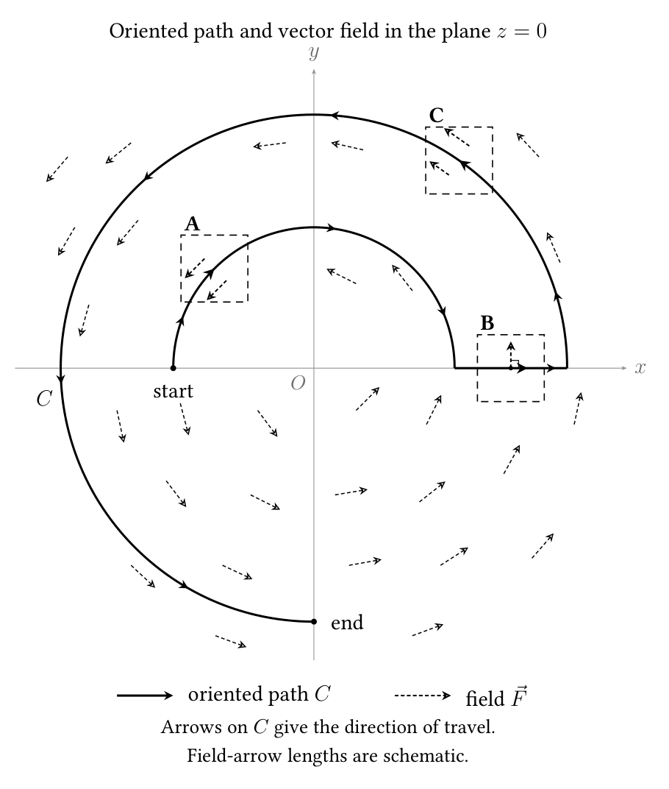

# Quiz 6 draft shortlist

Four selected questions cover spherical coordinates, scalar line integrals,
vector line integrals, and the signs of local contributions to a vector
line integral. The selected set below balances geometric interpretation
with short calculations. Shortlist A is now Question 1; the six remaining
alternatives are retained below. These instructor notes include answers
and source references; no additional lecture examples are added.

Final documents: [quiz source](q6-261-II2026.tex),
[quiz PDF](q6-261-II2026.pdf),
[solution source](q6-sol-261-II2026.tex), and
[solution PDF](q6-sol-261-II2026.pdf).
The quiz is dated October 9, 2026, following the weekly Friday schedule.

## Selected four

| Question | Focus | Proposed task | Expected answer |
| --- | --- | --- | --- |
| 1 | Spherical coordinates | A radial integral over a conical piece of a spherical shell (shortlist A) | \(\pi(2-\sqrt2)\ln2\) |
| 2 | Scalar line integral | A fly samples scent along a tilted loop in three dimensions | \(4\pi\) |
| 3 | Vector line integral | A rational-looking field along a parabola | \(-2\) |
| 4 | Graphical interpretation | Signs along three highlighted pieces of an oriented curve | A negative, B zero, C positive |

All three calculations use direct parametrization or coordinate conversion.
They do not require conservative fields, Green's theorem, Stokes' theorem,
or the divergence theorem. The final sheet retains the established
four-question, choose-two format, with answer boxes at the ends of the
questions. Question 4 has three small labeled answer boxes, A, B, and C,
stacked to the right of its diagram, leaving more scratch space for Question 3.

For spherical coordinates, use
\[
x=\rho\sin\varphi\cos\theta,\qquad
y=\rho\sin\varphi\sin\theta,\qquad z=\rho\cos\varphi,
\]
where \(\varphi\) is measured from the positive \(z\)-axis. All
parametrized paths below follow increasing parameter values.

### 1 A conical piece of a spherical shell — selected from A

**Proposed student wording**

Use spherical coordinates to evaluate
\[
\iiint_E\frac{dV}{(x^2+y^2+z^2)^{3/2}},\qquad
E=\{(x,y,z):1\leq x^2+y^2+z^2\leq4,\quad
z\geq\sqrt{x^2+y^2}\}.
\]

**Answer and short verification**

The two spheres give \(1\leq\rho\leq2\), and the solid lies above
the upper cone. Thus the bounds are
\[
\left\{
\begin{aligned}
&0\leq\theta\leq2\pi,\\
&0\leq\varphi\leq\pi/4,\\
&1\leq\rho\leq2.
\end{aligned}
\right.
\]
Thus
\[
\begin{aligned}
I&=\int_0^{2\pi}\int_0^{\pi/4}\int_1^2
\frac{\sin\varphi}{\rho}\,d\rho\,d\varphi\,d\theta\\
&=2\pi\left(1-\frac1{\sqrt2}\right)\ln2
=\boxed{\pi(2-\sqrt2)\ln2}.
\end{aligned}
\]

**Why this fits:** the bounds are straightforward, while the nonconstant
integrand tests the spherical Jacobian: \(\rho^{-3}\) becomes
\(\rho^{-1}\) after multiplication by \(\rho^2\sin\varphi\).
The inner sphere keeps the singularity outside the region.

**Source:** [UCR triple-integral list](../../SourcesUCR/Lista-5-MA-1003-Int-Triples-II-2021.pdf#page=3),
page 3, exercise 1.9. Radii \(2,3\) are changed to \(1,2\), and
the side of the upper cone is specified explicitly.

### 2 A fly sampling scent along a tilted loop

**Proposed student wording**

A fly follows
\[
\vec r(t)=(\cos t,\sin t,2+\cos t+\sin t),
\qquad0\leq t\leq2\pi.
\]
The scent intensity is \(\sigma(x,y,z)=\sqrt{1+(x-y)^2}\).
Compute its scent-weighted flight length
\[
S=\int_C\sigma\,ds.
\]

**Answer and short verification**

\[
\vec r\,'(t)=(-\sin t,\cos t,\cos t-\sin t),\qquad
\|\vec r\,'(t)\|=\sqrt{1+(\cos t-\sin t)^2}.
\]
The scalar field along the curve is exactly the same square root. Hence
\[
S=\int_0^{2\pi}\bigl(1+(\cos t-\sin t)^2\bigr)\,dt
=\int_0^{2\pi}(2-\sin2t)\,dt
=\boxed{4\pi}.
\]

**Why this fits:** this is a spatial path with varying height and speed.
The radicals look substantial but cancel when the scalar field is
multiplied by the speed. It tests the distinction between \(ds\) and
\(dt\), without leaving students with a difficult antiderivative.
The loop lies in the tilted plane \(z=x+y+2\); if you prefer a
nonplanar flight, choose the helix in E or F below.
The quantity is explicitly weighted by distance, not a claim about the
amount inhaled or a time-based exposure.

**Source:** [UCR line-integral list](../../SourcesUCR/Lista-6-MA-1003-Int-línea-II-2021.pdf#page=1),
page 1, exercise 1.4. The original is a wire on
\(x^2+y^2=1,\ z=x+y+6\), with density \(\sqrt{2(1-xy)}\).
Here the height is shifted to \(2\), the parametrization is supplied,
and the density is written as \(\sqrt{1+(x-y)^2}\). The densities
agree on \(x^2+y^2=1\), while the new expression is real and positive
throughout space. The fly story is an original adaptation.

### 3 A vector integral with a useful cancellation

**Proposed student wording**

Compute \(\displaystyle\int_C\vec F\cdot d\vec r\), where
\[
\vec F(x,y)=\left(\frac{y\cos x}{x^2},-\frac{\sin x}{2x}\right),
\qquad
\vec r(t)=(t,t^2),\quad \frac\pi2\leq t\leq\pi.
\]

**Answer and short verification**

\[
\vec F(\vec r(t))=\left(\cos t,-\frac{\sin t}{2t}\right),
\qquad \vec r\,'(t)=(1,2t).
\]
Consequently,
\[
\int_C\vec F\cdot d\vec r
=\int_{\pi/2}^{\pi}(\cos t-\sin t)\,dt
=[\sin t+\cos t]_{\pi/2}^{\pi}
=\boxed{-2}.
\]

**Why this fits:** the field rewards substitution into both components
and a careful dot product. No arc-length square root belongs here, making
this a useful contrast with Question 2. The entire path has \(x>0\), so
the denominators cause no domain issue.

**Source:** [Moodle export 009](../../SourcesUCR/Moodle/preguntas-II.S.2021.RRF.MA-1003.009-top-20260406-2207.html),
“ILPD-V1,” question 11721830. The field and parabola are retained; the
final parameter is changed from \(5\pi/4\) to \(\pi\), giving the
cleaner answer \(-2\). The parametrization is supplied explicitly.

### 4 Local signs from a field and an oriented path

**Proposed student wording**

The curve \(C\) and the field arrows shown lie in the plane \(z=0\).
For the oriented piece of \(C\) inside each dashed square A, B, and C,
state whether its contribution to
\(\displaystyle\int_C\vec F\cdot d\vec r\)
is **positive**, **negative**, or **zero**. The arrowheads on the bold
curve give its direction; the thinner dashed arrows show the field.
Their alignment persists along each highlighted piece.
No calculation is required.

**Instructor answer**

| Square | Field relative to the oriented tangent | Contribution |
| --- | --- | --- |
| A | Opposite direction | Negative |
| B | Perpendicular | Zero |
| C | Same direction | Positive |

Use three labeled sign entries in the final answer area; no written
explanation needs to be required from students. Accept the words above
or the symbols \(-,0,+\).

**Why this fits:** the path turns back against the field, moves across it,
then follows it. The signs come from local dot products, not from whether
the path is going left, right, upward, or downward. The picture asks about
three local pieces, not the sign or magnitude of the integral over the
entire path. Arrow lengths are schematic and are not data for calculating
an integral.

The drawing is a planar slice of a spatial field, deliberately avoiding
the ambiguity of judging three-dimensional angles from a perspective
projection. The fly question supplies the genuinely varying-height path.
It is designed for black-and-white printing: direction arrowheads lie
directly on the bold path, and the field uses thinner dashed arrows with
open arrowheads. There are no separate tangent vectors; students infer
the oriented tangent from the path itself. Dashed squares identify A,
B, and C without relying on color.

**Construction and verification for the instructor only**

The underlying field is \(\vec F(x,y,z)=(-y,x,0)\). The path follows
a radius-\(2\) clockwise upper semicircle from \((-2,0,0)\) to
\((2,0,0)\), moves radially outward to \((18/5,0,0)\), and then
follows a radius-\(18/5\) counterclockwise arc through three quarters
of a turn. The squares are away from the joining corners and each contains
only one piece of the path.

With \(\vec T\) the unit oriented tangent,
\[
\vec F\cdot\vec T=-2\ \text{on the inner arc},\qquad
\vec F\cdot\vec T=0\ \text{on the radial segment},\qquad
\vec F\cdot\vec T=18/5\ \text{on the outer arc}.
\]
These relationships hold throughout the highlighted portions, not merely
at three isolated sample points. The field formula and answers are not
printed in the student-facing diagram.

**Source:** original graphical question based on your proposed format.
Figure files: [PDF](figures/q6-field-signs.pdf),
[PNG](figures/q6-field-signs.png), and
[editable TikZ source](figures/q6-field-signs.tex).

## Spherical shortlist

### A A conical piece of a spherical shell — selected

This is now **Question 1** above, with its student wording, spherical
bounds, verified answer, and source. It is no longer an alternative.

### B A weighted spherical cap

**Replace Question 1 with:** Use spherical coordinates to evaluate
\[
\iiint_E(x^2+y^2+z^2)\,dV,\qquad
E=\{x^2+y^2+z^2\leq4,\ z\geq1\}.
\]

**Answer:** \(\boxed{49\pi/10}\).

The bounds are
\[
\left\{
\begin{aligned}
&0\leq\theta\leq2\pi,\\
&0\leq\varphi\leq\pi/3,\\
&\sec\varphi\leq\rho\leq2.
\end{aligned}
\right.
\]
Thus
\[
I=\frac{2\pi}{5}\int_0^{\pi/3}
(32-\sec^5\varphi)\sin\varphi\,d\varphi
=\frac{2\pi}{5}\left(16-\frac{15}{4}\right)
=\frac{49\pi}{10}.
\]
This is the strongest spherical alternative if you want a harder bounds
question: the plane produces a variable **inner** radius. It needs no
splitting, and the substitution \(u=\cos\varphi\) handles the integral.

**Source:** [UCR triple-integral list](../../SourcesUCR/Lista-5-MA-1003-Int-Triples-II-2021.pdf#page=3),
page 3, exercise 1.12. The original three-part cylindrical/spherical task
is reduced to one spherical-coordinate evaluation.

### C A signed integral over a quarter shell

**Replace Question 1 with:** Use spherical coordinates to compute
\[
\iiint_E x\,dV,\qquad
E=\{1\leq x^2+y^2+z^2\leq4,\ x\leq0,\ y\geq0\}.
\]

**Answer:** \(\boxed{-15\pi/8}\).

The bounds are \(1\leq\rho\leq2\), \(0\leq\varphi\leq\pi\),
and \(\pi/2\leq\theta\leq\pi\). Substitution gives
\[
\left(\int_1^2\rho^3\,d\rho\right)
\left(\int_0^\pi\sin^2\varphi\,d\varphi\right)
\left(\int_{\pi/2}^\pi\cos\theta\,d\theta\right)
=\frac{15}{4}\cdot\frac\pi2\cdot(-1).
\]
This revives the region removed from Quiz 5, now as a calculation.
The negative answer is a useful check because \(x\leq0\) throughout
the region. This is not a mass calculation with a negative density.

**Source:** [Moodle export 009](../../SourcesUCR/Moodle/preguntas-II.S.2021.RRF.MA-1003.009-top-20260406-2207.html),
“P5-CE-V1,” question 11721839. The source already asks for this integral;
the multiple-choice format is changed to short answer.

## Scalar line integral alternatives

### D A helical wire with an absolute value

**Replace Question 2 with:** Find the mass of the wire
\[
\vec r(t)=(t,\cos t,\sin t),\qquad0\leq t\leq2\pi,
\]
whose linear density is \(\delta(x,y,z)=|z|\).

**Answer:** \(\boxed{4\sqrt2}\).

Since \(\|\vec r\,'(t)\|=\sqrt2\),
\[
M=\sqrt2\int_0^{2\pi}|\sin t|\,dt=4\sqrt2.
\]
The absolute value makes this more than a constant-speed substitution:
students must not cancel the lower half against the upper half. Choose
this together with F below if you want the fly story in the vector question.

**Source:** [UCR line-integral list](../../SourcesUCR/Lista-6-MA-1003-Int-línea-II-2021.pdf#page=1),
page 1, exercise 1.3; the mathematical data are unchanged.

### E A simpler fly flight with constant speed

**Replace Question 2 with:** A fly follows
\[
\vec r(t)=(3\cos t,3\sin t,4t),\qquad0\leq t\leq1.
\]
The scent intensity along its route is \(\sigma(x,y,z)=1+z\).
Compute its scent-weighted flight length \(S=\int_C\sigma\,ds\).

**Answer:** \(\boxed{15}\), since
\[
\|\vec r\,'(t)\|=5,\qquad
S=5\int_0^1(1+4t)\,dt=15.
\]
This is the most accessible scalar option: a spatial helix, a varying
scalar field, and a \(3\)-\(4\)-\(5\) speed calculation. The main
check is remembering the speed factor.

**Sources and adaptation:** the moving-animal story is inspired by
[2025 Quiz 6](../../../261II2025/Q/6/q6-261-II2025.tex), Question 2
(the shark and fish-density problem). A helix also appears in
[Moodle export 008](../../SourcesUCR/Moodle/preguntas-II.S.2021.RRF.MA-1003.008-top-20260406-2208.html),
“int-linea-def-3 (copiar),” question 11522295. The specific curve,
scalar field, and calculation here are original; neither source is
being copied as a complete exercise.

## Vector line integral alternatives

### F A fly working through opposing wind

**Replace Question 3 with:** A fly follows
\[
\vec r(t)=(\cos t,t,\sin t),\qquad0\leq t\leq\pi/2.
\]
A wind exerts the force \(\vec F(x,y,z)=(z,0,-x)\).
Compute the work **done by the wind**,
\(W=\int_C\vec F\cdot d\vec r\).

**Answer:** \(\boxed{-\pi/2}\).

\[
\vec F(\vec r(t))=(\sin t,0,-\cos t),\qquad
\vec r\,'(t)=(-\sin t,1,\cos t),
\]
so the dot product is \(-\sin^2t-\cos^2t=-1\).
The path changes all three coordinates, and the negative answer means
the wind opposes the motion in the work calculation. Asking for work
“against the wind” would change the sign, so the prompt deliberately
uses “done by.” This pairs especially well with scalar alternative D.

**Source:** [2024 Quiz 7](../../../261II2024/Q/7/q7-261-II2024.tex),
Question 2, supplies the field \((z,0,-x)\). The path and fly story
are new; the original used two parametrizations of a line and asked
additional questions about conservativity and reparametrization.

### G Wind work along a tilted circle

**Replace Question 3 with:** Compute the work of
\[
\vec F(x,y,z)=(x-y,y-z,x-z)
\]
along \(\vec r(t)=(\cos t,\sin t,\sin t)\),
\(0\leq t\leq2\pi\).

**Answer:** \(\boxed{2\pi}\).

Along the path, \(\vec F(\vec r(t))=(\cos t-\sin t,0,\cos t-\sin t)\),
and therefore
\[
\vec F(\vec r(t))\cdot\vec r\,'(t)
=(\cos t-\sin t)^2=1-\sin2t.
\]
This is a direct three-dimensional vector calculation with a clean
trigonometric simplification. If you choose it, scalar alternative D or
E avoids using tilted circles for both line-integral questions.

**Source:** [UCR line-integral list](../../SourcesUCR/Lista-6-MA-1003-Int-línea-II-2021.pdf#page=2),
page 2, exercise 1.12. The field is retained; the four-segment diamond
\(|x|+|y|=1,\ z=y\) is replaced by a smooth tilted circle, avoiding
four separate parametrizations.

## Current selection

The selected set is **A, 2, 3, 4**, with **A now numbered Question 1**:
a radial integral over a conical shell, a nonconstant-speed fly path,
a field with useful cancellation, and the black-and-white sign diagram.
Questions 2 and 3 are unchanged. The sign answers in Question 4 are also
unchanged: **A negative, B zero, C positive**.
Alternatives B–G remain available for reference; no additional lecture
examples are included.

For calculations, algebraically equivalent exact answers receive the
same credit. The final quiz requires the evaluated result in the
answer box, with the calculation in the surrounding scratch space;
Question 4 requires only its three signs.
